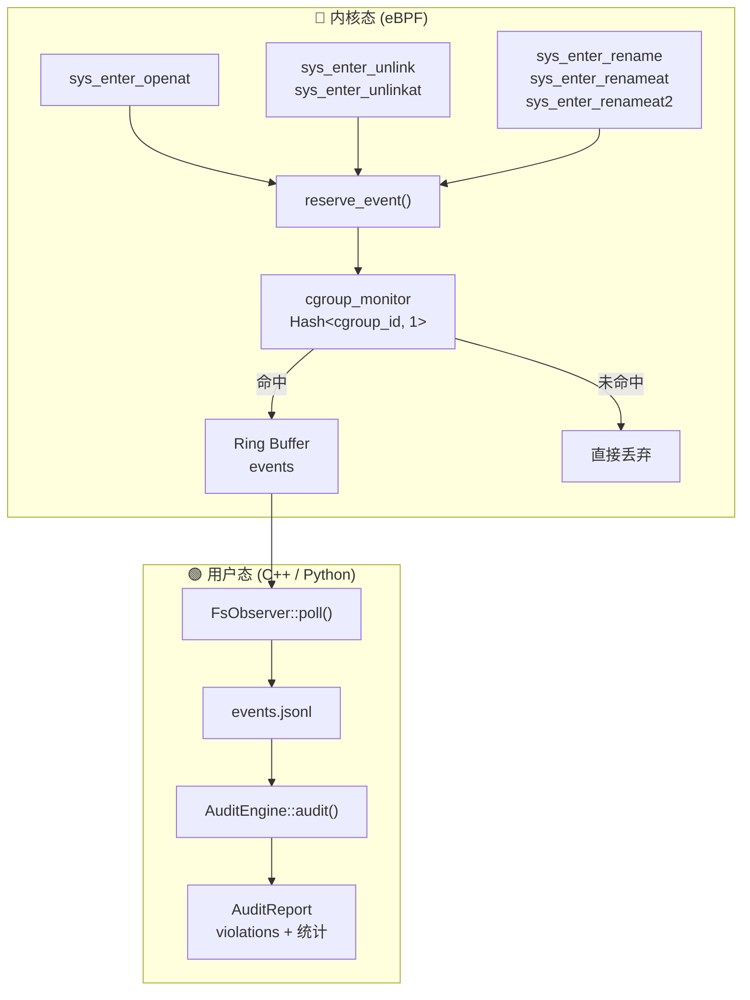

# ghostbpf-observ

基于 eBPF 的 **文件系统事件监控与审计** 框架。在内核态通过 tracepoint 捕获文件操作，在用户态进行规则审计。

## 架构



### 数据流

```
系统调用 → tracepoint → cgroup 过滤 → ring buffer → JSONL 日志 → 规则审计 → 报告
```

## 组件

| 组件 | 文件 | 说明 |
|------|------|------|
| **eBPF 探针** | `bpf/observ_fs.bpf.c` | 6 个 tracepoint，捕获 OPEN / CREATE / DELETE / RENAME |
| **共享结构** | `bpf/observ_common.h` | `fs_event` 结构体，BPF 与用户态共享 |
| **FsObserver** | `src/fs_observer.cpp` | 加载 BPF、按 cgroup 过滤、轮询 ring buffer、写 JSONL |
| **AuditEngine** | `src/audit_engine.cpp` | 加载规则集、解析 JSONL、路径前缀匹配、生成报告 |
| **静态库** | `libghostbpf-observ.a` | 可被其他项目直接链接 |
| **Demo** | `src/demo.cpp` + `demo.py` | 端到端演示脚本 |

## 事件类型

`struct fs_event`（568 字节，通过 ring buffer 传递，避免 BPF 栈溢出）：

| 字段 | 说明 |
|------|------|
| `timestamp_ns` | 纳秒时间戳 |
| `pid / tid` | 进程 / 线程 ID |
| `uid / gid` | 用户 / 组 ID |
| `cgroup_id` | 触发进程所在 cgroup |
| `event_type` | OPEN / CREATE / DELETE / RENAME |
| `flags` | 文件打开标志（如 O_CREAT） |
| `comm[16]` | 进程名 |
| `path[256]` | 主路径 |
| `new_path[256]` | 目标路径（仅 RENAME） |

## 审计规则

采用 **allowlist + denylist + default-deny** 三层策略：

```
优先级：deny > allow > default-deny（无匹配规则视为违规）
```

- `AuditEngine::add_allow_rule(event_type, path_prefix)` — 白名单
- `AuditEngine::add_deny_rule(event_type, path_prefix)`  — 黑名单
- `event_type = -1` 表示匹配所有事件类型
- 路径匹配为前缀匹配：`/etc/` 匹配 `/etc/passwd`

## 构建

```bash
cmake -B build
cmake --build build
```

产物：
- `build/libghostbpf-observ.a` — 静态库
- `build/observ_demo` — 演示程序

## 运行 Demo

### Python（推荐）

```bash
sudo python3 demo.py
```

脚本自动完成全流程：
1. 创建临时 cgroup
2. 启动 BPF 录制
3. 在 cgroup 内执行文件操作（CREATE、OPEN、RENAME、DELETE）
4. 等待录制完成
5. 加载审计规则并打印报告
6. 清理临时文件

输出示例：

```
  [CREATE] pid= 21364  comm=python3  path=/tmp/observ_demo/hello.txt
  [OPEN  ] pid= 21364  comm=python3  path=/tmp/observ_demo/hello.txt
  [RENAME] pid= 21364  comm=python3  path=/tmp/observ_demo/notes.txt → notes.bak
  [DELETE] pid= 21364  comm=python3  path=/tmp/observ_demo/data.log

  ========== AUDIT REPORT ==========
  Total events:     10
  Total violations: 0
  ✓ No violations detected.
```

### C++

```bash
# 找到目标 cgroup 的 inode
ls -li /sys/fs/cgroup/system.slice/sshd.service

# 录制 30 秒并审计
sudo ./build/observ_demo 12345 30
```

## 覆盖的系统调用

| 系统调用 | 事件类型 | 备注 |
|----------|----------|------|
| `openat` + `O_CREAT` | CREATE | |
| `openat`（无 O_CREAT） | OPEN | |
| `unlink` | DELETE | 非 at 变体 |
| `unlinkat` | DELETE | at 变体 |
| `rename` | RENAME | 非 at 变体 |
| `renameat` | RENAME | at 变体 |
| `renameat2` | RENAME | 新内核变体 |

## 依赖

- Linux 内核 ≥ 5.8（BPF ring buffer）
- clang（BPF 编译目标）
- libbpf、bpftool（vendored，自动编译）
- CMake ≥ 3.16
- C++20 编译器

## 许可证

- `bpf/` — GPL-2.0
- `src/`、`include/` — MIT
