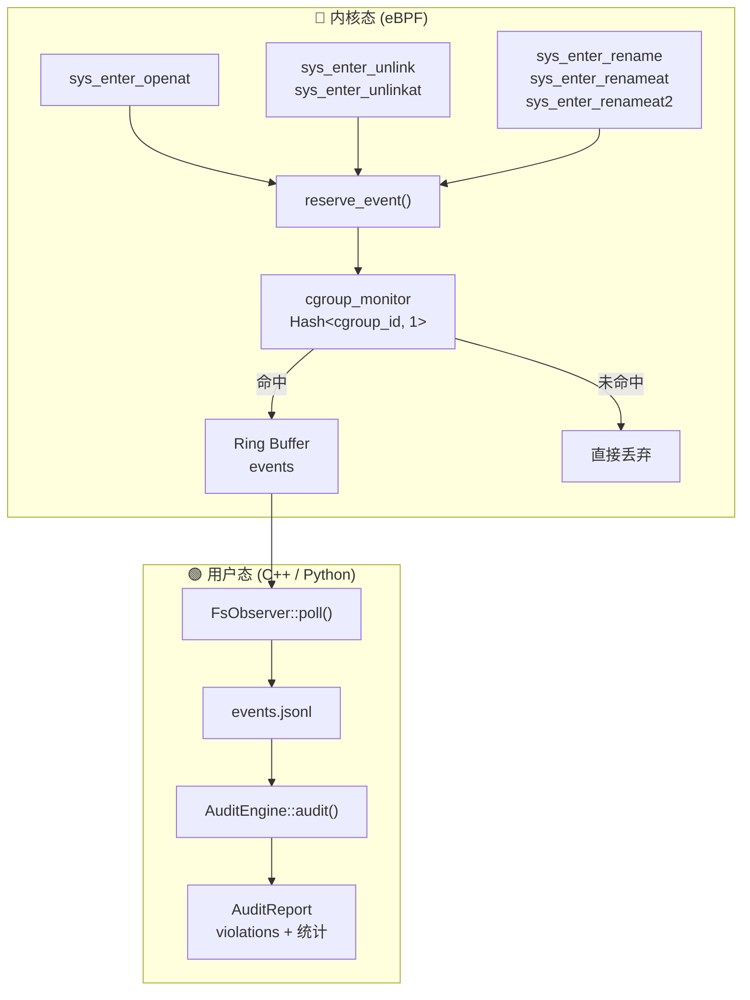

# ShadowObserve

基于 eBPF 的 **文件系统与进程事件监控、审计与白名单执行** 框架。在内核态通过 tracepoint 捕获文件操作和进程事件，在用户态进行规则审计；审计通过后安装 LSM 白名单 eBPF 程序限制 cgroup 的后续操作。

作为 Penumbra 项目的观测与执行层，与 ShadowFS（文件系统层）、ShadowProc（进程层）通过编排器协同工作。

## 架构

```
┌─────────────────────────────────────────────────────────────────┐
│                    内核态 (eBPF)                                 │
│                                                                 │
│  ┌─────────────────────────┐   ┌─────────────────────────────┐  │
│  │  observ.bpf.o           │   │  enforce.bpf.o              │  │
│  │  (tracepoint 探针)       │   │  (LSM 白名单执行器)         │  │
│  │                         │   │                             │  │
│  │  sys_enter_openat       │   │  lsm/file_open              │  │
│  │  sys_enter_unlink/at    │   │  lsm/inode_create           │  │
│  │  sys_enter_rename/at/at2│   │  lsm/inode_unlink           │  │
│  │  sys_enter_execve       │   │  lsm/inode_rename           │  │
│  │  sched_process_fork/exit│   │  lsm/inode_mkdir            │  │
│  │  ...                    │   │  lsm/inode_rmdir            │  │
│  └──────────┬──────────────┘   └──────────────▲──────────────┘  │
│             │                                 │                 │
│     cgroup 过滤                         whitelist_rules 查询    │
│             │                                 │                 │
│             ▼                                 │                 │
│      Ring Buffer ────────────────────── BPF Hash Maps           │
└─────────────┬─────────────────────────────────┬─────────────────┘
              │                                 │
┌─────────────▼─────────────────────────────────┬─────────────────┐
│                用户态 (C++)                    │                 │
│                                               │                 │
│  Observer          AuditEngine     Enforcer ──┘                 │
│    │                  │               │                         │
│    ▼                  ▼               │                         │
│  JSONL 日志 ──────► 规则审计 ──► 白名单安装                       │
│                                               │                 │
│  SocketServer (daemon) ← Unix socket JSON-line API              │
└─────────────────────────────────────────────────────────────────┘
```

### 数据流

```
观测: 系统调用 → tracepoint → cgroup 过滤 → ring buffer → JSONL 日志
审计: JSONL 日志 → 规则匹配 → 违规报告
执行: 审计通过 → 安装 LSM 白名单 → 后续操作受 eBPF 强制执行限制
```

## 组件

| 组件 | 文件 | 说明 |
|------|------|------|
| **eBPF 探针** | `bpf/observ.bpf.c` | tracepoint 探针，捕获 FS + PROC 事件 |
| **eBPF 执行器** | `bpf/enforce.bpf.c` | LSM 钩子白名单强制执行（6 个 LSM hook） |
| **共享结构** | `bpf/observ_common.h` | `observ_event` 结构体，事件类型常量 |
| **Observer** | `src/observer.cpp` | 加载 BPF、按 cgroup 过滤、轮询 ring buffer、写 JSONL |
| **AuditEngine** | `src/audit_engine.cpp` | 加载规则集、解析 JSONL、路径前缀匹配、生成报告 |
| **Enforcer** | `src/enforcer.cpp` | 加载 enforce BPF、管理白名单规则、启用/禁用 cgroup 执行 |
| **SocketServer** | `src/socket_server.cpp` | daemon 实现，Unix socket JSON-line API |
| **Daemon** | `src/daemon.cpp` | daemon 入口 |
| **静态库** | `libghostbpf-observ.a` | 可被其他项目直接链接 |
| **Demo** | `src/demo.cpp` + `demo.py` | 端到端演示 |

## 事件类型

### 文件系统事件

| 常量 | 值 | 说明 |
|------|-----|------|
| `FS_EVENT_OPEN` | 1 | 文件打开 |
| `FS_EVENT_CREATE` | 2 | 文件创建 |
| `FS_EVENT_DELETE` | 3 | 文件删除 |
| `FS_EVENT_RENAME` | 4 | 重命名 |
| `FS_EVENT_CHMOD` | 5 | 权限修改 |
| `FS_EVENT_CHOWN` | 6 | 属主修改 |
| `FS_EVENT_MKDIR` | 7 | 创建目录 |
| `FS_EVENT_RMDIR` | 8 | 删除目录 |
| `FS_EVENT_LINK` | 9 | 硬链接 |
| `FS_EVENT_SYMLINK` | 10 | 符号链接 |
| `FS_EVENT_TRUNCATE` | 11 | 截断 |

### 进程事件

| 常量 | 值 | 说明 |
|------|-----|------|
| `PROC_EVENT_EXEC` | 100 | 程序执行 |
| `PROC_EVENT_FORK` | 101 | 进程 fork |
| `PROC_EVENT_EXIT` | 102 | 进程退出 |
| `PROC_EVENT_KILL` | 103 | 信号发送 |
| `PROC_EVENT_PRCTL` | 104 | prctl 调用 |
| `PROC_EVENT_PTRACE` | 105 | ptrace 调用 |
| `PROC_EVENT_SETUID` | 106 | setuid 调用 |
| `PROC_EVENT_CAPSET` | 107 | 能力修改 |

### 事件结构体

`struct observ_event`（通过 ring buffer 从内核态传递到用户态）：

| 字段 | 类型 | 说明 |
|------|------|------|
| `timestamp_ns` | `u64` | 纳秒时间戳 |
| `pid / tid` | `u32` | 进程 / 线程 ID |
| `uid / gid` | `u32` | 用户 / 组 ID |
| `cgroup_id` | `u64` | 触发进程所在 cgroup |
| `event_type` | `u16` | FS_EVENT_* 或 PROC_EVENT_* |
| `arg1 / arg2 / arg3` | `u32` | 事件相关参数（flags/mode/pid 等） |
| `comm[16]` | `char` | 进程名 |
| `path[256]` | `char` | 主路径 |
| `new_path[256]` | `char` | 目标路径（rename/link/symlink） |

## 审计规则

采用 **allowlist + denylist + default-deny** 三层策略：

```
优先级：deny > allow > default-deny（无匹配规则视为违规）
```

- `AuditEngine::add_allow_rule(event_type, path_prefix)` — 白名单
- `AuditEngine::add_deny_rule(event_type, path_prefix)` — 黑名单
- `event_type = -1` 表示匹配所有事件类型
- 路径匹配为前缀匹配：`/etc/` 匹配 `/etc/passwd`

## 白名单执行（Enforcer）

审计通过后，Enforcer 安装 LSM eBPF 程序，限制 cgroup 仅执行白名单内的操作：

| LSM Hook | 拦截操作 |
|----------|----------|
| `lsm/file_open` | 文件打开 |
| `lsm/inode_create` | 文件创建 |
| `lsm/inode_unlink` | 文件删除 |
| `lsm/inode_rename` | 重命名 |
| `lsm/inode_mkdir` | 创建目录 |
| `lsm/inode_rmdir` | 删除目录 |

白名单匹配逻辑（4 级回退）：
1. 精确匹配：cgroup_id + event_type + path_prefix
2. 通配事件：cgroup_id + 0xFFFF + path_prefix
3. 通配路径：cgroup_id + event_type + ""
4. 全局通配：cgroup_id + 0xFFFF + ""

## 构建

```bash
cd ShadowObserve
mkdir -p build && cd build
cmake .. -DCMAKE_BUILD_TYPE=Release
make -j$(nproc)
```

产物：
- `build/libghostbpf-observ.a` — 静态库
- `build/observ_demo` — 演示程序
- `build/observ_daemon` — daemon 服务（提供 Unix socket API）

## Unix Socket API

daemon 启动后在指定 socket 路径提供 JSON-line 协议的控制 API：

| Action | 参数 | 说明 |
|--------|------|------|
| `start_observe` | `cgroup_id`, `log_path` | 启动 eBPF 事件观测 |
| `stop_observe` | `cgroup_id` | 停止观测 |
| `audit` | `log_path`, `rules` | 对事件日志执行规则审计 |
| `get_events` | `log_path`, `limit` | 获取已录制的事件 |
| `install_whitelist` | `cgroup_id`, `allowed_ops` | 安装白名单 eBPF LSM 过滤器 |
| `remove_whitelist` | `cgroup_id` | 移除白名单 |

```bash
# 启动 daemon
sudo ./build/observ_daemon --sock /tmp/shadowobserve.sock

# 开始观测
echo '{"action":"start_observe","cgroup_id":12345,"log_path":"/tmp/events.jsonl"}' \
  | socat - UNIX-CONNECT:/tmp/shadowobserve.sock

# 审计
echo '{"action":"audit","log_path":"/tmp/events.jsonl","rules":[
  {"event_type":-1,"action":"allow","path_pattern":"/tmp/"}
]}' | socat - UNIX-CONNECT:/tmp/shadowobserve.sock

# 安装白名单
echo '{"action":"install_whitelist","cgroup_id":12345,"allowed_ops":[
  {"event_type":1,"path_prefix":"/tmp/"},
  {"event_type":2,"path_prefix":"/tmp/"}
]}' | socat - UNIX-CONNECT:/tmp/shadowobserve.sock
```

## 运行 Demo

### Python（推荐）

```bash
sudo python3 demo.py
```

脚本自动完成全流程：
1. 创建临时 cgroup
2. 启动 BPF 录制
3. 在 cgroup 内执行文件操作（CREATE、OPEN、RENAME、DELETE）
4. 等待录制完成
5. 加载审计规则并打印报告
6. 清理临时文件

### C++

```bash
# 找到目标 cgroup 的 inode
ls -li /sys/fs/cgroup/system.slice/sshd.service

# 录制 30 秒并审计
sudo ./build/observ_demo 12345 30
```

## 依赖

- Linux 内核 >= 5.15（BPF ring buffer + BPF LSM）
- clang（BPF 编译目标）
- libbpf、bpftool（vendored 在 `third_party/`，自动编译）
- CMake >= 3.16
- C++20 编译器
- libelf-dev, zlib1g-dev

## 许可证

- `bpf/` — GPL-2.0
- `src/`、`include/` — MIT
# ghostbpf-observ

基于 eBPF 的 **文件系统事件监控与审计** 框架。在内核态通过 tracepoint 捕获文件操作，在用户态进行规则审计。

## 架构



### 数据流

```
系统调用 → tracepoint → cgroup 过滤 → ring buffer → JSONL 日志 → 规则审计 → 报告
```

## 组件

| 组件 | 文件 | 说明 |
|------|------|------|
| **eBPF 探针** | `bpf/observ_fs.bpf.c` | 6 个 tracepoint，捕获 OPEN / CREATE / DELETE / RENAME |
| **共享结构** | `bpf/observ_common.h` | `fs_event` 结构体，BPF 与用户态共享 |
| **FsObserver** | `src/fs_observer.cpp` | 加载 BPF、按 cgroup 过滤、轮询 ring buffer、写 JSONL |
| **AuditEngine** | `src/audit_engine.cpp` | 加载规则集、解析 JSONL、路径前缀匹配、生成报告 |
| **静态库** | `libghostbpf-observ.a` | 可被其他项目直接链接 |
| **Demo** | `src/demo.cpp` + `demo.py` | 端到端演示脚本 |

## 事件类型

`struct fs_event`（568 字节，通过 ring buffer 传递，避免 BPF 栈溢出）：

| 字段 | 说明 |
|------|------|
| `timestamp_ns` | 纳秒时间戳 |
| `pid / tid` | 进程 / 线程 ID |
| `uid / gid` | 用户 / 组 ID |
| `cgroup_id` | 触发进程所在 cgroup |
| `event_type` | OPEN / CREATE / DELETE / RENAME |
| `flags` | 文件打开标志（如 O_CREAT） |
| `comm[16]` | 进程名 |
| `path[256]` | 主路径 |
| `new_path[256]` | 目标路径（仅 RENAME） |

## 审计规则

采用 **allowlist + denylist + default-deny** 三层策略：

```
优先级：deny > allow > default-deny（无匹配规则视为违规）
```

- `AuditEngine::add_allow_rule(event_type, path_prefix)` — 白名单
- `AuditEngine::add_deny_rule(event_type, path_prefix)`  — 黑名单
- `event_type = -1` 表示匹配所有事件类型
- 路径匹配为前缀匹配：`/etc/` 匹配 `/etc/passwd`

## 构建

```bash
cmake -B build
cmake --build build
```

产物：
- `build/libghostbpf-observ.a` — 静态库
- `build/observ_demo` — 演示程序

## 运行 Demo

### Python（推荐）

```bash
sudo python3 demo.py
```

脚本自动完成全流程：
1. 创建临时 cgroup
2. 启动 BPF 录制
3. 在 cgroup 内执行文件操作（CREATE、OPEN、RENAME、DELETE）
4. 等待录制完成
5. 加载审计规则并打印报告
6. 清理临时文件

输出示例：

```
  [CREATE] pid= 21364  comm=python3  path=/tmp/observ_demo/hello.txt
  [OPEN  ] pid= 21364  comm=python3  path=/tmp/observ_demo/hello.txt
  [RENAME] pid= 21364  comm=python3  path=/tmp/observ_demo/notes.txt → notes.bak
  [DELETE] pid= 21364  comm=python3  path=/tmp/observ_demo/data.log

  ========== AUDIT REPORT ==========
  Total events:     10
  Total violations: 0
  ✓ No violations detected.
```

### C++

```bash
# 找到目标 cgroup 的 inode
ls -li /sys/fs/cgroup/system.slice/sshd.service

# 录制 30 秒并审计
sudo ./build/observ_demo 12345 30
```

## 覆盖的系统调用

| 系统调用 | 事件类型 | 备注 |
|----------|----------|------|
| `openat` + `O_CREAT` | CREATE | |
| `openat`（无 O_CREAT） | OPEN | |
| `unlink` | DELETE | 非 at 变体 |
| `unlinkat` | DELETE | at 变体 |
| `rename` | RENAME | 非 at 变体 |
| `renameat` | RENAME | at 变体 |
| `renameat2` | RENAME | 新内核变体 |

## 依赖

- Linux 内核 ≥ 5.8（BPF ring buffer）
- clang（BPF 编译目标）
- libbpf、bpftool（vendored，自动编译）
- CMake ≥ 3.16
- C++20 编译器

## 许可证

- `bpf/` — GPL-2.0
- `src/`、`include/` — MIT
